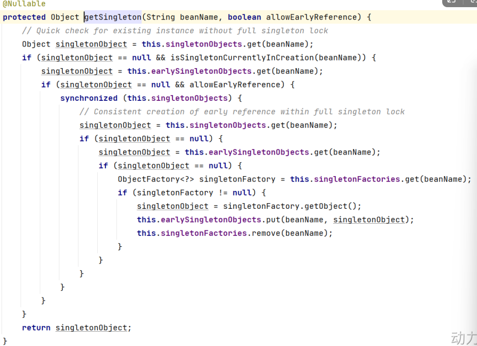

# Spring中的八大设计模式

## 简单工厂模式（静态工厂）

`BeanFactory`中的`getBean()`方法，通过唯一标识获取Bean对象，

## 工厂方法模式

`FactoryBean`是典型的工厂方法模式

在配置文件中，通过`factory-method`属性来指定工厂方法，该方法是一个实例方法

## 单例模式

Spring用的是双重判断加锁的单例模式

## 代理模式

Spring中的AOP使用的就是动态代理

## 装饰器模式

JavaSE中的IO流是典型的装饰器模式

Spring中配置DataSource的时候，这些datasource可能是不同类型，比如不同的数据库、不同的数据源

这时，Spring使用装饰着模式，在尽可能少修改原有代码类的情况下，根据每次请求的不同，将数据源设置为不同的数据源，以达到切换数据源的目的

**Spring中类名带有：Decorator和Wrapper的类，都使用了装饰器模式**

## 观察者模式

定义对象间的一对多关系，当一个对象的状态发生变化时，所有依赖于他的对象都得到通知并自动更新，

Spring中的观察者模式一般在listener的实现

Spring中的事件编程模型就是观察者模式的实现，在Spring中定义了一个接口`ApplicationListener`接口，用来监听`Application`事件

`Application`其实就是`ApplicationContext`，`ApplicationContext`内置了几个事件，其中比较容易理解的是：`ContextRefreshedEvent`、`ContextStartedEvent`、`ContextStoppedEvent`、`ContextClosedEvent`

## 策略模式

策略模式是行为模式，调用不同方法，适应行为的变化，情调父类的调用子类的特性

`getHandler`是`HandlerMapping`接口中的唯一方法，用于根据请求找到匹配的处理器

比如，我们写了一个`AccountDao`接口，然后接口下有不同的实现类：`AccountDaoForMySQL`、`AccountDaoForOracle`

对于service来说，不需要关系底层的具体实现，只需要面向接口调用，底层可以灵活的实现切换，这就是策略模式

## 模板方法模式

Spring中的JdbcTemplate类就是一个模板类，他就是一个模板方法设计模式的具体体现，在模板类的模板方法`execute`中编写核心算法，具体实现步骤在子类完成	