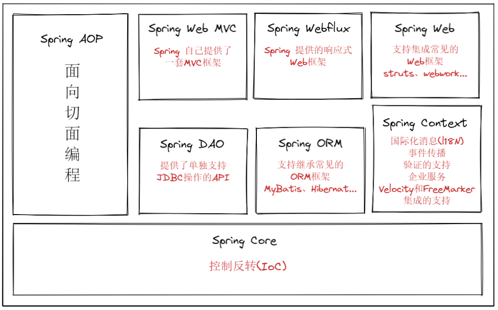

# Spring 引入
1、开发中，需要遵循OCP原则
> OCP原则(是软件七大开发原则中最核心、最基本的原则)
> - 对扩展开放
> - 对修改关闭
> - 原则的核心：**对项目进行功能扩展的时候，不会修改原来的代码**

2、依赖倒置原则(DIP原则)
> 上层 不依赖 下层
> - 核心
>   - 倡导：面向抽象编程、面向接口编程
>     - 不要依赖具体编程 ==> (Xxx xxx = new XxxImpl())
>   - 目标：降低程序的耦合度，提高扩展力

解决方案：
    通过**控制反转IoC(Inversion of Control)**
- IoC反转了两件事：
  - 1、不在程序中采用硬编码的方式new对象。(将new对象的权力上交)
  - 2、不在程序中采用硬编码的方式维护对象之间的关系。(将对象之间关系的维护权上交)

3、Spring框架
> Spring框架实现了控制反转IoC的思想
>   - Spring框架可以帮助new对象
>   - Spring框架可以帮助维护对象之间的关系

Spring框架是一个实现了IoC思想的容器
- 控制反转的实现方式有多种，其中比较重要的就是：**依赖注入(Dependency Injection, 简称DI)**
  - 控制反转是思想
  - 依赖注入是控制反转思想的具体实现
    - "依赖": 对象之间的关系
    - "注入": 通过**注入**这种手段，让对象之间产生关系
    - **注入**常见的两种方式：
      - set注入(通过set方法，给属性赋值)
      - 构造方法注入(通过构造方法，给属性赋值)

# Spring框架的8大模块
> 在Spring5之后，加入了Spring Webflux模块

# Spring框架的特点

1. 轻量 

   a. 从⼤⼩与开销两⽅⾯⽽⾔Spring都是轻量的。完整的Spring框架可以在⼀个⼤⼩只有1MB多的 
      JAR⽂件⾥发布。并且Spring所需的处理开销也是微不⾜道的。 

   b. Spring是⾮侵⼊式的：Spring应⽤中的对象不依赖于Spring的特定类。

2. 控制反转

   a. Spring通过⼀种称作控制反转（IoC）的技术促进了松耦合。当应⽤了IoC，⼀个对象依赖的其
   它对象会通过被动的⽅式传递进来，⽽不是这个对象⾃⼰创建或者查找依赖对象。你可以认为
   IoC与JNDI相反——不是对象从容器中查找依赖，⽽是容器在对象初始化时不等对象请求就主动
   将依赖传递给它。

3. ⾯向切⾯

   a. Spring提供了⾯向切面编程的丰富⽀持，允许通过分离应⽤的业务逻辑与系统级服务（例如审
   计（auditing）和事务（transaction）管理）进⾏内聚性的开发。应⽤对象只实现它们应该做
   的——完成业务逻辑——仅此⽽已。它们并不负责（甚⾄是意识）其它的系统级关注点，例如
   ⽇志或事务⽀持。

4. 容器

   a. Spring包含并管理应⽤对象的配置和⽣命周期，在这个意义上它是⼀种容器，你可以配置你的
   每个bean如何被创建——基于⼀个可配置原型（prototype），你的bean可以创建⼀个单独的
   实例或者每次需要时都⽣成⼀个新的实例——以及它们是如何相互关联的。然⽽，Spring不应
   该被混同于传统的重量级的EJB容器，它们经常是庞⼤与笨重的，难以使⽤。

5. 框架

   a. Spring可以将简单的组件配置、组合成为复杂的应⽤。在Spring中，应⽤对象被声明式地组
   合，典型地是在⼀个XML⽂件⾥。Spring也提供了很多基础功能（事务管理、持久化框架集成
   等等），将应⽤逻辑的开发留给了你。
   所有Spring的这些特征使你能够编写更⼲净、更可管理、并且更易于测试的代码。它们也为Spring中的
   各种模块提供了基础⽀持