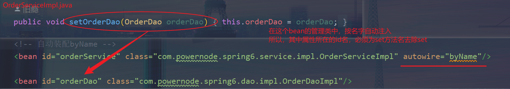
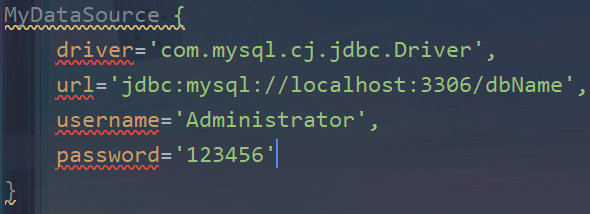

# Spring对IoC的实现

## IoC控制反转

- 控制反转是一种思想
- 控制反转是为了降低程序的耦合度，提高程序的扩展力，以达到OCP、DIP原则
- 控制反转的方式：
    - 将对象创建的权力交由**第三方容器负责**
    - 将对象之间关系的维护权力交由**第三方容器负责**
- 控制反转思想的实现：DI(Dependency Injection)依赖注入

## DI(依赖注入)

> 依赖注入实现了控制反转的思想
> 依赖：对象之间的关联关系
> 注入：一种数据的传递行为，通过注入行为让对象之间产生关系
> Spring通过依赖注入的方式，完成对Bean的管理
> Bean管理：

- Bean对象的创建
- Bean对象中属性的赋值(Bean对象之间关系的维护)

依赖注入的方式：

- 1、set注入
    - xml文件配置
      - ```xml
        <!-- 通过bean管理对象 -->
        <bean id="userDaoBean" class="com.powernode.spring6.dao.impl.UserDaoImpl"/>
        <bean id="vipDaoBean" class="com.powernode.spring6.dao.impl.VipDaoImpl"/>
        <bean id="userServiceBean" class="com.powernode.spring6.service.impl.UserServiceImpl">
           <!-- set注入将对象联系起来 -->
           <!--
               name: set方法名去除set【setUserDao ==> userDao】
               ref: 指定需要注入bean的id
           -->
           <property name="userDao" ref="userDaoBean"/>
           <property name="vipDao" ref="vipDaoBean"/>
        </bean>
        ```
- 2、构造注入
    - xml文件配置
    - ```xml
      <bean id="orderDaoBean" class="com.powernode.spring6.dao.impl.OrderDaoImpl"/>
      <bean id="orderServiceBean" class="com.powernode.spring6.service.impl.OrderServiceImpl">
            <!-- 构造注入将对象联系起来 -->
            <!--
                ref: 指定需要注入bean的id 
                根据配置的参数数量，自动匹配相应参数数量的构造器
                并且自动进行类型匹配，顺序不会影响
            -->
            <constructor-arg ref="userDaoBean"/>
            <constructor-arg ref="orderDaoBean"/>

            <!--
                index: 有参构造器的参数下标【从0开始】
            -->
            <constructor-arg index="0" ref="orderDaoBean"/> 
            <constructor-arg index="1" ref="userDaoBean"/> 

            <!--
                name: 构造器参数的参数名
            -->
            <constructor-arg name="userDao" ref="userDaoBean"/>
            <constructor-arg name="orderDao" ref="orderDaoBean"/>
      </bean>
      ```

### set注入-进阶

> 配置文件【set-di.xml】

1、注入内部Bean、外部Bean

```xml
<!-- 声明外部bean -->
<bean id="orderDaoBean" class="...">
    <!-- 使用ref属性来引入，就是注入外部bean -->
    <property name="" ref="orderDaoBean"/>
</bean>

<bean id="" class="...">
<!-- 注入内部bean -->
<property name="">
    <bean class="..."/>
</property>
</bean>
```

2、注入简单类型

```xml
<bean id="" class="">
    <!-- 通过value属性赋值 -->
    <property name="" value=""/>
</bean>
```

- Spring支持的简单类型：
  - [八种基本数据类型(包装类) | Enum | CharSequence | Number | Date | URI | URL | Locale | Class]
  - ```java
    public static boolean isSimpleValueType(Class<?> type) {
        return Void.class != type && Void.TYPE != type
        && (ClassUtils.isPrimitiveOrWrapper(type) // 八种基本数据类型，及其包装类
        || Enum.class.isAssignableFrom(type) // 枚举类
        || CharSequence.class.isAssignableFrom(type) // 字符串序列(String implements CharSequence)
        || Number.class.isAssignableFrom(type) // 数字类型(Integer... implements Number)
        || Date.class.isAssignableFrom(type) // 日期类型(推荐使用ref类型，如果需要必须按规定格式，否则报异常)
        || Temporal.class.isAssignableFrom(type) // Java8之后提供的时间和时区类型
        || URI.class == type // URI地址
        || URL.class == type // URL地址
        || Locale.class == type // 语言类
        || Class.class == type); // Class类
    }
    ```

3、级联属性赋值
```xml
<bean id="studentBean" class="com.powernode.spring6.bean.Student">
    <property name="name" value="张三"/>

    <!-- 通过级联属性赋值, 下面两个顺序不可颠倒 -->
    <!-- 使用级联属性赋值, 需要提供get方法 -->
    <property name="clazz" ref="clazzBean"/>
    <property name="clazz.name" value="高三一班"/>
</bean>

<bean id="clazzBean" class="com.powernode.spring6.bean.Clazz"/>
```

4、数组属性赋值
```xml

<bean id="w1" class="com.powernode.spring6.bean.Women">
    <property name="name" value=""/>
</bean>
<bean id="w2" class="com.powernode.spring6.bean.Women">
    <property name="name" value=""/>
</bean>

<bean id="" class="">
<!-- 数组中，存储的是简单数据类型 -->
<property name="...">
    <array>
        <value></value>
        <value></value>
        ...
    </array>
</property>

<!-- 数组中，存储的是复杂数据类型 -->
<property name="...">
    <array>
        <ref bean="w1"/>
        <ref bean="w2"/>
        ...
    </array>
</property>
</bean>
```

5、集合属性赋值
- List集合
  - ```xml
    <bean id="" class="">
          <property name="names">
              <!-- 有序可重复 -->
              <list>
                  <value>张三</value>
                  <value>李四</value>
                  <value>王五</value>
                  <value>王五</value>
                  <value>王五</value>
              </list>
          </property>
    </bean>
    ```
- Set集合
  - ```xml
    <bean id="" class="">
          <property name="names">
              <!-- 无序，不可重复 -->
              <set>
                  <value>张三</value>
                  <value>李四</value>
                  <value>王五</value>
                  <value>王五</value>
                  <value>王五</value>
              </set>
          </property>
    </bean>
    ```
- Map集合
  - ```xml
    <bean id="" class="">
        <property name="sessions">
            <map>
                <!-- 非简单数据类型 -->
                <!-- <entry key-ref="..." value-ref="..."/>-->

                <!-- 简单数据类型 -->
                <entry key="1" value="abc"/>
                <entry key="2" value="def"/>
                <entry key="3" value="ghi"/>
            </map>
        </property>
    </bean>
    ```
  - Properties集合(继承了Hashtable<Object,Object>，规定其key-value都必须为String)
    - ```xml
      <bean id="" classs="">
        <property name="properties">
            <props>
                <prop key="url">jdbc:mysql://localhost:3306/bdName</prop>
                <prop key="driver">com.mysql.cj.jdbc.Driver</prop>
            </props>
        </property>
      </bean>
      ```

6、null值注入
```xml
<bean id="" class="">
    <!-- 不提供value或ref属性，则此属性为null -->
    <porperty name="driver"/>
  
    <!-- 如果将value值设置为null，仅仅只是将字符串"null"注入 -->
    <porperty name="driver" value="null"/>
    
   <!-- 手动将name值设置为空 -->
    <property name="driver">
      <null/>
    </property>
</bean>
```

7、注入特殊符号

两种解决方案：
- 使用转义字符代替
  - | 特殊字符 | 转义字符    |
    |------|---------|
    | \>   | \&gt;   | 
    | <    | \&lt;   |
    | '    | \&apos; | 
    | "    | \&quot; | 
    | &    | \&amp;  | 
- 将含有特殊符号的字符串放到：<![CDATA[]]>当中
  - 放在<![CDATA[]]>区中的数据不会被XML文件解析器解析
```xml

<bean id="" class="">
    <!-- 使用转义字符 -->
    <property name="result" value="1 &lt; 2"/>

    <!-- 将特殊字符放到<![CDATA[]]>域中 -->
    <!-- 此方法只能使用value标签 -->
    <property name="result">
        <value><![CDATA[1 < 2]]></value>
    </property>
</bean>
```

8、p命名空间注入
> 底层基于set方法注入
> 用于适当简化set注入
```xml
<?xml version="1.0" encoding="UTF-8"?>
<beans xmlns="http://www.springframework.org/schema/beans"
       xmlns:xsi="http://www.w3.org/2001/XMLSchema-instance"
       xmlns:p="http://www.springframework.org/schema/p"
       xsi:schemaLocation="http://www.springframework.org/schema/beans http://www.springframework.org/schema/beans/spring-beans.xsd">

    <!-- 使用spring的p命名空间 -->

    <!--
        1、开启p命名空间
        粘贴复制：xmlns:p="http://www.springframework.org/schema/p" 放到头文件
     -->

    <!--
        2、使用p命名空间
        p:属性名 ==> 简单数据类型
        p:属性名-ref ==> 复杂数据类型
    -->
    <bean id="dateBean" class="java.util.Date"/>
    <bean id="" class=""
          p:name="小白" p:age="10" p:date-ref="dateBean"/>
</beans>
```

9、util命名空间注入
> 简化开发，实现代码复用
```xml
<?xml version="1.0" encoding="UTF-8"?>
<beans xmlns="http://www.springframework.org/schema/beans"
       xmlns:xsi="http://www.w3.org/2001/XMLSchema-instance"
       xmlns:util="http://www.springframework.org/schema/util"
       xsi:schemaLocation="http://www.springframework.org/schema/beans http://www.springframework.org/schema/beans/spring-beans.xsd
                           http://www.springframework.org/schema/util http://www.springframework.org/schema/util/spring-util.xsd">

    <!-- util命名空间注入 -->

    <!--
        头部插入：
        xmlns:util="http://www.springframework.org/schema/util"
        修改.xsd文件
        xsi:schemaLocation="http://www.springframework.org/schema/beans http://www.springframework.org/schema/beans/spring-beans.xsd
                           http://www.springframework.org/schema/util http://www.springframework.org/schema/util/spring-util.xsd">
        ==> 启用util约束
    -->

    <!-- 使用util命名空间注入 -->
    <util:properties id="prop">
        <prop key="driver">com.mysql.cj.jdbc.Driver</prop>
        <prop key="url">jdbc:mysql://localhost:3306/dbName</prop>
        <prop key="username">root</prop>
        <prop key="password">123456</prop>
    </util:properties>

    <bean id="mds" class="com.powernode.spring6.source.MyDataSource">
        <property name="properties" ref="prop"/>
    </bean>
    <bean id="mds1" class="com.powernode.spring6.source.MyDataSource1">
        <property name="properties" ref="prop"/>
    </bean>
    <bean id="mds2" class="com.powernode.spring6.source.MyDataSource2">
        <property name="properties" ref="prop"/>
    </bean>
</beans>
```

### 构造注入
> c命名空间注入，底层基于构造方法注入
> 适当简化构造注入的开发

```xml
<?xml version="1.0" encoding="UTF-8"?>
<beans xmlns="http://www.springframework.org/schema/beans"
       xmlns:xsi="http://www.w3.org/2001/XMLSchema-instance"
       xmlns:c="http://www.springframework.org/schema/c"
       xsi:schemaLocation="http://www.springframework.org/schema/beans http://www.springframework.org/schema/beans/spring-beans.xsd">

    <!-- 总体和p命名空间相同 -->
    <!-- 
        进行传值的时候，也可以使用下标
        c:_0="小黑"
        c:_1="8"
        c:_2-ref="birthBean"
     -->
    <bean id="birthBean" class="java.util.Date"/>
    <bean id="catBean" class="com.powernode.spring6.bean.Cat"
          c:name="小黑" c:age="8" c:birth-ref="birthBean"/>
</beans>
```

### 基于XML的自动装配byName(基于set方法)
```xml
<!-- 根据名字自动装配 -->
<!-- 通过set方法的名字，自动匹配相应id的bean对象 -->
<bean id="orderService" class="com.powernode.spring6.service.impl.OrderServiceImpl" autowire="byName"/>

<bean id="orderDao" class="com.powernode.spring6.dao.impl.OrderDaoImpl"/>
```


### 基于XML的自动装配byType(基于set方法)
```xml
<!-- 根据类型自动装配 -->
<!-- 根据set方法中参数的类型，自动匹配相应类型的bean对象 -->
<bean class="com.powernode.spring6.dao.impl.UserDaoImpl"/>
<bean class="com.powernode.spring6.dao.impl.VipDaoImpl"/>
<bean id="userServiceBean" class="com.powernode.spring6.service.impl.UserServiceImpl" autowire="byType"/>
```

### Spring引入外部属性文件
```xml
<?xml version="1.0" encoding="UTF-8"?>
<beans xmlns="http://www.springframework.org/schema/beans"
       xmlns:xsi="http://www.w3.org/2001/XMLSchema-instance"
       xmlns:context="http://www.springframework.org/schema/context"
       xsi:schemaLocation="http://www.springframework.org/schema/beans http://www.springframework.org/schema/beans/spring-beans.xsd
                           http://www.springframework.org/schema/context http://www.springframework.org/schema/context/spring-context.xsd">

    <!--
        1、引入context命名空间，设置约束
            xmlns:context="http://www.springframework.org/schema/context"
            xsi:schemaLocation="http://www.springframework.org/schema/beans http://www.springframework.org/schema/beans/spring-beans.xsd
                           http://www.springframework.org/schema/context http://www.springframework.org/schema/context/spring-context.xsd"
         2、使用context命名空间
     -->
    <!-- location自动从类路径中加载文件 -->
    <context:property-placeholder location="jdbc.properties"/>

    <bean id="mds" class="com.powernode.spring6.bean.MyDataSource">
        <property name="driver" value="${driver}"/>
        <property name="url" value="${url}"/>
        <property name="username" value="${username}"/>
        <property name="password" value="${password}"/>
    </bean>
</beans>
```
```properties
driver=com.mysql.cj.jdbc.Driver
url=jdbc:mysql://localhost:3306/dbName
username=root
password=123456
```
注意：当我们进行这样设置，并配置的时候，spring默认从本机的系统环境变量加载配置
所以，当匹配到系统环境变量root的时候，输出的是主机root，而不是我们配置的root


这样非常不利于管理，因此通常我们将配置文件写为
```properties
jdbc.driver=com.mysql.cj.jdbc.Driver
jdbc.url=jdbc:mysql://localhost:3306/dbName
jdbc.username=root
jdbc.password=123456
```