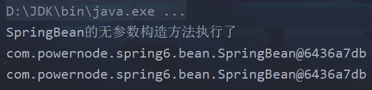

# Bean的作用域

默认情况下，spring的IoC容器创建的bean对象是单例的(singleton)
- 只在创建Spring的上下文对象的时候，bean对象被创建
- 之后，每一次调用getBean方法，都是获取这个bean对象
```java
ApplicationContext applicationContext =
        new ClassPathXmlApplicationContext("spring-scope.xml");

SpringBean springBean = applicationContext.getBean("springBean", SpringBean.class);
System.out.println(springBean);

SpringBean springBean2 = applicationContext.getBean("springBean", SpringBean.class);
System.out.println(springBean2);
```


可以通过配置xml文件中bean的scope属性，来进行切换
其中的：prototype值，可以使bean对象，变为多例的(prototype: 多例 | 原型)
- 在创建Spring的上下文对象的时候，不会再创建bean对象
- 而是，在调用getBean的时候，bean对象才会创建
- 调用几次，则会创建几次对象

## xml文件中bean的scope属性，可以有多种
> 如果使用，需要引入相应的框架

- singleton: 默认的，单例
- prototype: 原形，每调用一次getBean()方法，创建一个新的Bean对象
- 仅限于WEB应用中使用
  - request: 一个请求对应一个Bean对象
  - session: 一个会话对应一个Bean对象
  - application: 一个应用对应一个Bean对象
  - websocket: 一个websocket声明周期对应一个Bean对象
- portlet应用中专用
  - global session: 如果在Servlet的WEB应用中使用global session的话，和session是一个效果，
    (portlet和servlet都是规范。
        servlet运行在servlet容器中
        portlet运行在portlet容器中)
- 自定义scope: 很少使用
  - 1、首先定义一个类，实现Scope接口
    -   spring内置了线程范围的类：org.springframework.context.support.SimpleThreadScope，可以直接用。
  - 2、将自定义的Scope注册到Spring容器中
    - ```xml
      <bean class="org.springframework.beans.factory.config.CustomScopeConfigurer">
        <property name="scopes">
            <map>
                <entry key="myThread">
                    <bean class="org.springframework.context.support.SimpleThreadScope"/>
                </entry>
            </map>
        </property>
      </bean>
      ```
  - 3、使用Scope
    - ```xml
      <bean id="sb" class="com.powernode.spring6.beans.SpringBean" scope="myThread" />
      ```
  - 4、编写测试程序
    - ```java
      @Test
      public void testMyThreadScope() {
       ApplicationContext applicationContext =
                 new ClassPathXmlApplicationContext("spring-scope.xml");
       SpringBean springBean = applicationContext.getBean("springBean", SpringBean.class);
       System.out.println("springBean" + springBean);
       SpringBean springBean1 = applicationContext.getBean("springBean", SpringBean.class);
       System.out.println("springBean" + springBean1);

       // 启动线程
       new Thread(new Runnable() {
            @Override
            public void run() {
                SpringBean springBean2 = applicationContext.getBean("springBean", SpringBean.class);
                System.out.println("springBean" + springBean2);
                SpringBean springBean3 = applicationContext.getBean("springBean", SpringBean.class);
                System.out.println("springBean" + springBean3);
            }
        }).start();
      }
      ```