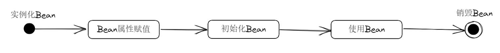
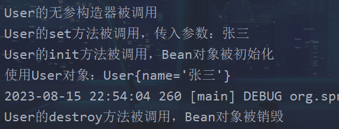
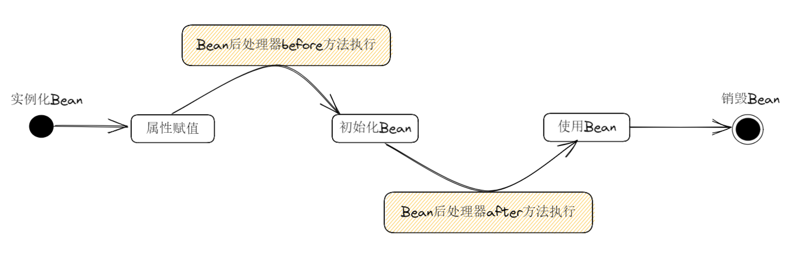
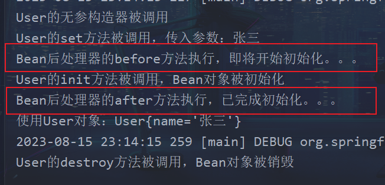
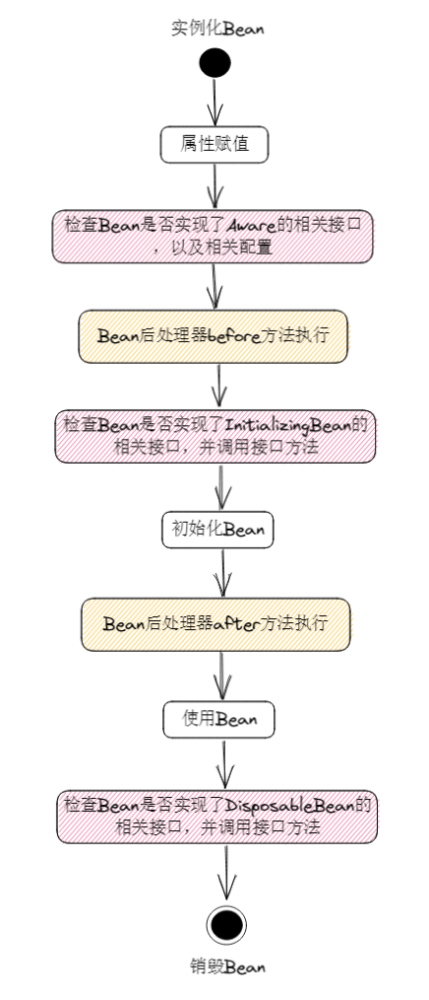
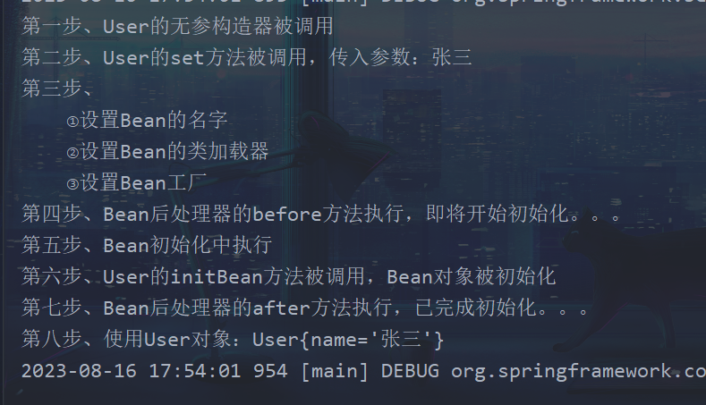
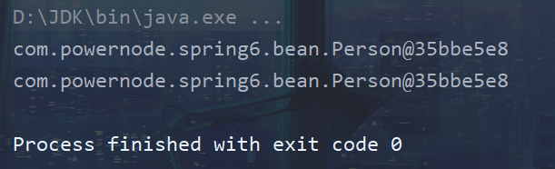

# Bean的生命周期


## 什么是Bean的生命周期

Spring 其实就是一个管理Bean对象的工厂

负责对象的创建、对象的销毁等

生命周期就是：对象从创建开始到最终销毁的整个过程

- 创建Bean对象的时机
- 创建Bean对象的前后调用的方法
- Bean对象的销毁时机
- Bean对象销毁前后调用的方法


## Bean的5步生命周期

Bean生命周期的管理，可参考Spring源码：`AbstractAutowireCapableBeanFactory`

类中的`doCreateBean()`方法

Bean的生命周期，粗略分为五步：

- 实例化Bean：**调用Bean的无参构造方法**
- Bean属性赋值：**调用Bean对象的set方法**
- 初始化Bean：**调用Bean对象的init方法**（**但是，init方法需要自己写，自己配置**）
- 使用Bean：**调用Bean对象**
- 销毁Bean：**调用Bean对象的destroy方法**（**同样，destroy方法也需要自己写，自己配置**）



**测试程序**

```java
package com.powernode.spring6.bean;

/**
 * @author Solider
 * @version 1.0
 * @since 1.0
 */
public class User {
    private String name;

    public User() {
        System.out.println("User的无参构造器被调用");
    }

    public User(String name) {
        this.name = name;
    }

    public void setName(String name) {
        System.out.println("User的set方法被调用，传入参数：" + name);
        this.name = name;
    }

    public void init() {
        System.out.println("User的init方法被调用，Bean对象被初始化");
    }

    @Override
    public String toString() {
        return "User{" +
                "name='" + name + '\'' +
                '}';
    }

    public void destroy() {
        System.out.println("User的destroy方法被调用，Bean对象被销毁");
    }
}
```

```xml
<?xml version="1.0" encoding="UTF-8"?>
<beans xmlns="http://www.springframework.org/schema/beans"
       xmlns:xsi="http://www.w3.org/2001/XMLSchema-instance"
       xsi:schemaLocation="http://www.springframework.org/schema/beans http://www.springframework.org/schema/beans/spring-beans.xsd">

    <bean id="user" class="com.powernode.spring6.bean.User" init-method="init" destroy-method="destroy">
        <property name="name" value="张三"/>
    </bean>

</beans>
```

```java
package com.powernode.spring6.test;

import com.powernode.spring6.bean.User;
import org.junit.Test;
import org.springframework.context.ApplicationContext;
import org.springframework.context.support.ClassPathXmlApplicationContext;

/**
 * @author Solider
 * @version 1.0
 * @since 1.0
 */
public class BeanLifecycleTest {

    @Test
    public void testBeanLifecycle() {
        ApplicationContext applicationContext =
                new ClassPathXmlApplicationContext("spring.xml");
        User user = applicationContext.getBean("user", User.class);
        System.out.println("使用User对象：" + user);

        // 手动销毁IoC容器
        ClassPathXmlApplicationContext context = (ClassPathXmlApplicationContext) applicationContext;
        context.close();
    }
}
```




## Bean的7步生命周期

> 在初步的5部中，可以在初始化Bean前、后添加代码
>
> 可以加入Bean后处理器



编写一个类，实现`BeanPostProcessor`类，并重写`before`和`after`方法

```java
package com.powernode.spring6.bean;

import org.springframework.beans.BeansException;
import org.springframework.beans.factory.config.BeanPostProcessor;

/**
 * @author Solider
 * @version 1.0
 * @since 2.0
 */
public class LogBeanPostProcessor implements BeanPostProcessor {
   
    /**
     * @param bean 实例化的Bean对象
     * @param beanName 实例化Bean对象的名字
     * @return Bean对象，默认为Object
     */
    @Override
    public Object postProcessBeforeInitialization(Object bean, String beanName)
            throws BeansException {
        System.out.println("Bean后处理器的before方法执行，即将开始初始化。。。");
        return BeanPostProcessor.super.postProcessBeforeInitialization(bean, beanName);
    }

    @Override
    public Object postProcessAfterInitialization(Object bean, String beanName)
            throws BeansException {
        System.out.println("Bean后处理器的after方法执行，已完成初始化。。。");
        return BeanPostProcessor.super.postProcessAfterInitialization(bean, beanName);
    }
}
```

```xml
<?xml version="1.0" encoding="UTF-8"?>
<beans xmlns="http://www.springframework.org/schema/beans"
       xmlns:xsi="http://www.w3.org/2001/XMLSchema-instance"
       xsi:schemaLocation="http://www.springframework.org/schema/beans http://www.springframework.org/schema/beans/spring-beans.xsd">

    <bean id="user" class="com.powernode.spring6.bean.User" init-method="init" destroy-method="destroy">
        <property name="name" value="张三"/>
    </bean>

    <!-- 配置Bean后处理器 -->
    <!-- 配置完之后，自动适配所有的Bean对象 -->
    <bean class="com.powernode.spring6.bean.LogBeanPostProcessor"/>

</beans>
```

- 配置完Bean后处理器之后，将作用于当前配置文件中所有的Bean对象


**调用原先的测试模块儿**




## Bean的10步生命周期

> 如果根据源码追踪，可以将Bean的生命周期，划分为十步



- 添加三个点位的特点：
  - 都是在检查这个Bean是否实现了某些特定的接口
  - 如果实现了这些接口，则Spring容器会调用这个接口中的方法
- Aware相关的接口包括：`BeanNameAware`、`BeanClassLoaderAware`、`BeanFactoryAware`
  - 当Bean实现了`BeanNameAware`，Spring会将Bean的名字传递给Bean
  - 当Bean实现了`BeanClassLoaderAware`，Spring会将加载该Bean的类加载器传递给Bean
  - 当Bean实现了`BeanFactoryAware`，Spring会将Bean工厂对象传递给Bean


```java
package com.powernode.spring6.bean;

import org.springframework.beans.BeansException;
import org.springframework.beans.factory.*;

/**
 * Bean的生命周期按照粗略的五步：
 * 1、实例化Bean对象（调用无参构造方法）
 * 2、给Bean对象属性赋值（调用set方法）
 * 3、初始化Bean对象（会调用Bean的init方法，但是这个方法需要自己写、自己配）
 * 4、使用Bean对象
 * 5、销毁Bean对象（会调用Bean对象的destroy方法，同样这个方法需要自己写、自己配）
 * @author Solider
 * @version 1.0
 * @since 1.0
 */
public class User implements
        BeanNameAware, BeanClassLoaderAware, BeanFactoryAware,
        InitializingBean, DisposableBean {
    private String name;

    public User() {
        System.out.println("第一步、User的无参构造器被调用");
    }

    public User(String name) {
        this.name = name;
    }

    public void setName(String name) {
        System.out.println("第二步、User的set方法被调用，传入参数：" + name);
        this.name = name;
    }

    public void initBean() {
        System.out.println("第六步、User的initBean方法被调用，Bean对象被初始化");
    }

    @Override
    public String toString() {
        return "User{" +
                "name='" + name + '\'' +
                '}';
    }

    public void destroyBean() {
        System.out.println("第十步、User的destroyBean方法被调用，Bean对象被销毁");
    }
            
    @Override
    public void setBeanName(String name) {
        System.out.println("第三步、");
        System.out.println("    ①设置Bean的名字");
    }

    @Override
    public void setBeanClassLoader(ClassLoader classLoader) {
        System.out.println("    ②设置Bean的类加载器");
    }

    @Override
    public void setBeanFactory(BeanFactory beanFactory) throws BeansException {
        System.out.println("    ③设置Bean工厂");
    }

    @Override
    public void afterPropertiesSet() throws Exception {
        System.out.println("第五步、Bean初始化中执行");
    }

    @Override
    public void destroy() throws Exception {
        System.out.println("第九步、Bean对象销毁之前 | Bean对象使用之后执行了");
    }
}
```

- 注意：
  - `setBeanName`是`BeanNameAware`中的方法，在程序中先执行
  - `setBeanClassLoader`是`BeanClassLoaderAware`中的方法，其次执行
  - `setBeanFactory`是`BeanFactoryAware`中的方法，在最后执行
  - **Spring会自动向这些方法传入相应的参数**，我们可以根据这些方法中的参数处理相应业务

```java
package com.powernode.spring6.bean;

import org.springframework.beans.BeansException;
import org.springframework.beans.factory.config.BeanPostProcessor;

/**
 * @author Solider
 * @version 1.0
 * @since 1.0
 */
public class LogBeanPostProcessor implements BeanPostProcessor {

    /**
     * @param bean 实例化的Bean对象
     * @param beanName 实例化Bean对象的名字
     * @return Bean对象，默认为Object
     */
    @Override
    public Object postProcessBeforeInitialization(Object bean, String beanName)
            throws BeansException {
        System.out.println("第四步、Bean后处理器的before方法执行，即将开始初始化。。。");
        return BeanPostProcessor.super.postProcessBeforeInitialization(bean, beanName);
    }

    @Override
    public Object postProcessAfterInitialization(Object bean, String beanName)
            throws BeansException {
        System.out.println("第七步、Bean后处理器的after方法执行，已完成初始化。。。");
        return BeanPostProcessor.super.postProcessAfterInitialization(bean, beanName);
    }
}
```

```xml
<?xml version="1.0" encoding="UTF-8"?>
<beans xmlns="http://www.springframework.org/schema/beans"
       xmlns:xsi="http://www.w3.org/2001/XMLSchema-instance"
       xsi:schemaLocation="http://www.springframework.org/schema/beans http://www.springframework.org/schema/beans/spring-beans.xsd">

    <bean id="user" class="com.powernode.spring6.bean.User" init-method="initBean" destroy-method="destroyBean">
        <property name="name" value="张三"/>
    </bean>

    <!-- 配置Bean后处理器 -->
    <!-- 配置完之后，自动适配所有的Bean对象 -->
    <bean class="com.powernode.spring6.bean.LogBeanPostProcessor"/>

</beans>
```

```java
package com.powernode.spring6.test;

import com.powernode.spring6.bean.User;
import org.junit.Test;
import org.springframework.context.ApplicationContext;
import org.springframework.context.support.ClassPathXmlApplicationContext;

/**
 * @author Solider
 * @version 3.0
 * @since 1.0
 */
public class BeanLifecycleTest {

    @Test
    public void testBeanLifecycle() {
        ApplicationContext applicationContext =
                new ClassPathXmlApplicationContext("spring.xml");
        User user = applicationContext.getBean("user", User.class);
        System.out.println("第八步、使用User对象：" + user);

        // 手动销毁IoC容器
        ClassPathXmlApplicationContext context = (ClassPathXmlApplicationContext) applicationContext;
        context.close();
    }
}
```


## Beand的作用域不同，管理方式不同

> - 对于singleton作用域的Bean，Spring能够精确的知道该Bean何时被创建、何时初始化完成、以及何时被销毁
>   - 而对于prototype作用域的Bean，Spring只负责创建，当容器创建了Bean的实例后，Bean的实例就交给客户端代码管理，Spring容器将不再追踪其生命周期

```xml
<?xml version="1.0" encoding="UTF-8"?>
<beans xmlns="http://www.springframework.org/schema/beans"
       xmlns:xsi="http://www.w3.org/2001/XMLSchema-instance"
       xsi:schemaLocation="http://www.springframework.org/schema/beans http://www.springframework.org/schema/beans/spring-beans.xsd">

    <bean id="user" class="com.powernode.spring6.bean.User" init-method="initBean" destroy-method="destroyBean" scope="prototype">
        <property name="name" value="张三"/>
    </bean>

    <!-- 配置Bean后处理器 -->
    <!-- 配置完之后，自动适配所有的Bean对象 -->
    <bean class="com.powernode.spring6.bean.LogBeanPostProcessor"/>

</beans>
```


**再次执行测试程序**




## 让Spring容器管理我们new出来的对象

```java
package com.powernode.spring6.bean;

/**
 * @author Solider
 * @version 1.0
 * @since 1.0
 */
public class Person {
}
```

```java
package com.powernode.spring6.test;

import com.powernode.spring6.bean.Person;
import org.junit.Test;
import org.springframework.beans.factory.support.DefaultListableBeanFactory;

/**
 * @author Solider
 * @version 1.0
 * @since 1.0
 */
public class RegisterBeanTest {

    @Test
    public void testBeanRegister() {

        // 自己new对象
        Person person = new Person();
        System.out.println(person);

        // 创建 默认的可列表Bean工厂
        DefaultListableBeanFactory factory = new DefaultListableBeanFactory();
        // 注册单例Bean
        factory.registerSingleton("personBean", person);

        // 从Spring容器中获取Bean
        Person personBean = factory.getBean("personBean", Person.class);
        System.out.println(personBean);
    }
}
```

