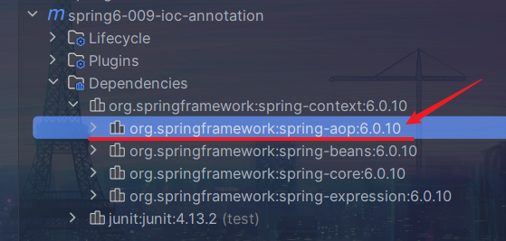
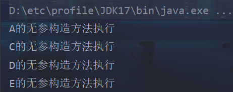
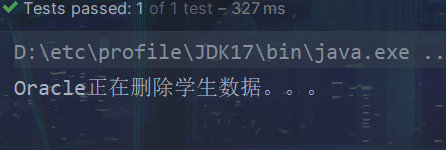
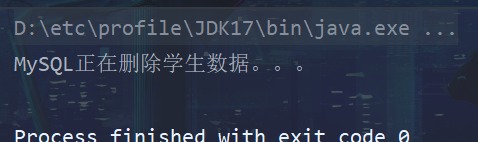

# Spring IoC注解式开发

> 注解的存在，主要是为了简化XML配置，**Spring6倡导全注解开发**


## 声明Bean的注解

> 负责声明Bean的注解，常见的包括四个：
>
> - @Component
> - @Controller：一般用在表示层，web层
> - @Service：一般用在业务层，service层
> - @Repository：一般用在持久层，dao层

**@Component**

```java
//
// Source code recreated from a .class file by IntelliJ IDEA
// (powered by FernFlower decompiler)
//

package org.springframework.stereotype;

import java.lang.annotation.Documented;
import java.lang.annotation.ElementType;
import java.lang.annotation.Retention;
import java.lang.annotation.RetentionPolicy;
import java.lang.annotation.Target;

@Target({ElementType.TYPE})
@Retention(RetentionPolicy.RUNTIME)
@Documented
@Indexed
public @interface Component {
    String value() default "";
}
```

**@Controller**

```java
//
// Source code recreated from a .class file by IntelliJ IDEA
// (powered by FernFlower decompiler)
//

package org.springframework.stereotype;

import java.lang.annotation.Documented;
import java.lang.annotation.ElementType;
import java.lang.annotation.Retention;
import java.lang.annotation.RetentionPolicy;
import java.lang.annotation.Target;
import org.springframework.core.annotation.AliasFor;

@Target({ElementType.TYPE})
@Retention(RetentionPolicy.RUNTIME)
@Documented
@Component
public @interface Controller {
    @AliasFor(
        annotation = Component.class
    )
    String value() default "";
}
```

**@Service**

```java
//
// Source code recreated from a .class file by IntelliJ IDEA
// (powered by FernFlower decompiler)
//

package org.springframework.stereotype;

import java.lang.annotation.Documented;
import java.lang.annotation.ElementType;
import java.lang.annotation.Retention;
import java.lang.annotation.RetentionPolicy;
import java.lang.annotation.Target;
import org.springframework.core.annotation.AliasFor;

@Target({ElementType.TYPE})
@Retention(RetentionPolicy.RUNTIME)
@Documented
@Component
public @interface Service {
    @AliasFor(
        annotation = Component.class
    )
    String value() default "";
}
```

**@Repository**

```java
//
// Source code recreated from a .class file by IntelliJ IDEA
// (powered by FernFlower decompiler)
//

package org.springframework.stereotype;

import java.lang.annotation.Documented;
import java.lang.annotation.ElementType;
import java.lang.annotation.Retention;
import java.lang.annotation.RetentionPolicy;
import java.lang.annotation.Target;
import org.springframework.core.annotation.AliasFor;

@Target({ElementType.TYPE})
@Retention(RetentionPolicy.RUNTIME)
@Documented
@Component
public @interface Repository {
    @AliasFor(
        annotation = Component.class
    )
    String value() default "";
}
```

- 注意：在`@Controller`、`@Service`、`@Repository`注解中含有`@AliasFor`
  - 可以说明此注解是`@Component`注解的别名
  - 因此，这四个注解类的功能是一样的
  - **取不同别名，为了增强程序的可读性**
  - **注解存在默认值，如果没有指定，那么默认值为首字母小写的类名**


## Spring注解的使用

> 1、加入AOP依赖（在加入了`spring-context`依赖后，会自动关联aop依赖）
>
> 2、在配置文件中，添加context命名空间
>
> 3、在配置文件中，指定被扫描的包
>
> 4、在Bean类上，使用注解


**第一步：**




**第二步：**

```xml
<?xml version="1.0" encoding="UTF-8"?>
<beans xmlns="http://www.springframework.org/schema/beans"
       xmlns:xsi="http://www.w3.org/2001/XMLSchema-instance"
       xmlns:context="http://www.springframework.org/schema/context"
       xsi:schemaLocation="http://www.springframework.org/schema/beans http://www.springframework.org/schema/beans/spring-beans.xsd
                           http://www.springframework.org/schema/context http://www.springframework.org/schema/context/spring-context.xsd">

</beans>
```


**第三步：**

```xml
<context:component-scan base-package="com.powernode.bean"/>
```


**第四步：**

```java
package com.powernode.bean;

import org.springframework.stereotype.Component;
import org.springframework.stereotype.Repository;

/**
 * @author Solider
 * @version 1.0
 * @Date 2023/8/25 18:46
 * @since 1.0
 */
// @Component("userBean") 注解存在默认值，可以省略value值
@Component // 默认为user
public class User {
}
```


### 指定多个包

- 1、在xml配置文件中，指定多个包名，使用`,`隔开

  ```xml
  <?xml version="1.0" encoding="UTF-8"?>
  <beans xmlns="http://www.springframework.org/schema/beans"
         xmlns:xsi="http://www.w3.org/2001/XMLSchema-instance"
         xmlns:context="http://www.springframework.org/schema/context"
         xsi:schemaLocation="http://www.springframework.org/schema/beans http://www.springframework.org/schema/beans/spring-beans.xsd
                             http://www.springframework.org/schema/context http://www.springframework.org/schema/context/spring-context.xsd">
      <context:component-scan base-package="com.powernode.bean, 
                                            com.powernode.service, 
                                            com.powernode.controller"/>
  </beans>
  ```

- 2、指定**父包包名**

  ```xml
  <?xml version="1.0" encoding="UTF-8"?>
  <beans xmlns="http://www.springframework.org/schema/beans"
         xmlns:xsi="http://www.w3.org/2001/XMLSchema-instance"
         xmlns:context="http://www.springframework.org/schema/context"
         xsi:schemaLocation="http://www.springframework.org/schema/beans http://www.springframework.org/schema/beans/spring-beans.xsd
                             http://www.springframework.org/schema/context http://www.springframework.org/schema/context/spring-context.xsd">
      <context:component-scan base-package="com.powernode"/>
  </beans>
  ```


## 选择性实例化Bean


*测试类*

```java
package com.powernode.bean2;

import org.springframework.stereotype.Component;
import org.springframework.stereotype.Controller;
import org.springframework.stereotype.Repository;
import org.springframework.stereotype.Service;

/**
 * @author Solider
 * @version 1.0
 * @Date 2023/8/25 19:17
 * @since 1.0
 */
@Component
public class A {
    public A() {
        System.out.println("A的无参构造方法执行");
    }
}

@Service
class B{
    public B() {
        System.out.println("B的无参构造方法执行");
    }
}

@Controller
class C {
    public C() {
        System.out.println("C的无参构造方法执行");
    }
}

@Repository
class D {
    public D() {
        System.out.println("D的无参构造方法执行");
    }
}

@Controller
class E {
    public E() {
        System.out.println("E的无参构造方法执行");
    }
}
```


`use-default-filters = false`


```xml
<?xml version="1.0" encoding="UTF-8"?>
<beans xmlns="http://www.springframework.org/schema/beans"
       xmlns:xsi="http://www.w3.org/2001/XMLSchema-instance"
       xmlns:context="http://www.springframework.org/schema/context"
       xsi:schemaLocation="http://www.springframework.org/schema/beans http://www.springframework.org/schema/beans/spring-beans.xsd
                           http://www.springframework.org/schema/context http://www.springframework.org/schema/context/spring-context.xsd">

    <!--
       采用use-default-filters="false"方式
            use-default-filters="false": 表示在这个包下关于Bean的注解不会被扫描到
            @Component、@Repository、@Service、@Controller，都会失效
       只对包含在标签中的注解生效
     -->
    <context:component-scan base-package="com.powernode.bean2" use-default-filters="false">
        <!--
            type: 过滤类型
            expression: 过滤类型的全限定类名
            只有Service注解的类才会被扫描到
         -->
        <context:include-filter type="annotation" expression="org.springframework.stereotype.Service"/>
    </context:component-scan>
</beans>
```


`use-default-filters = true`（**默认值**）

```xml
<?xml version="1.0" encoding="UTF-8"?>
<beans xmlns="http://www.springframework.org/schema/beans"
       xmlns:xsi="http://www.w3.org/2001/XMLSchema-instance"
       xmlns:context="http://www.springframework.org/schema/context"
       xsi:schemaLocation="http://www.springframework.org/schema/beans http://www.springframework.org/schema/beans/spring-beans.xsd
                           http://www.springframework.org/schema/context http://www.springframework.org/schema/context/spring-context.xsd">
    
    <!--
        use-default-filters="true"方式
            use-default-filters="true": 表示在这个包下关于Bean的注解会被扫描到
            @Component、@Repository、@Service、@Controller，都会生效
     -->
    <context:component-scan base-package="com.powernode.bean2" use-default-filters="true">
        <!--
            type: 过滤类型
            expression: 过滤类型的全限定类名
            除了Service注解的类都会被扫描到
         -->
        <context:exclude-filter type="annotation" expression="org.springframework.stereotype.Service"/>
    </context:component-scan>
</beans>
```




## 负责注入的注解

> @Component、@Controller、@Service、@Reposity
>
> 这四个注解，是用来声明Bean的，声明后这些Bean将被实例化


这四个注解，是负责给Bean的属性赋值

- @Value
- @Autowired
- @Qualifier
- @Resource


### @Value

> @Value注解，用来注入简单数据类型
>
> - 可以写到属性上
> - 可以写到set方法上（可以省略）
> - 可以写到构造方法上

```java
package com.powernode.bean3;

import org.springframework.beans.factory.annotation.Value;
import org.springframework.stereotype.Component;

/**
 * @author Solider
 * @version 1.0
 * @Date 2023/8/28 21:40
 * @since 1.0
 */
@Component
public class User {
    @Value("张三")
    private String name;

    @Value("18")
    private int age;

    // 当使用注解方式进行属性注入时，不需要提供set方法
        // @Value注解也可以写在set方法上
    @Value("李四")
    public void setName(String name) {
        this.name = name;
    }

    @Value("20")
    public void setAge(int age) {
        this.age = age;
    }
    

    // @Value注解也可以写在构造方法上
    public User(@Value("王五") String name, @Value("40") int age) {
        this.name = name;
        this.age = age;
    }

    @Override
    public String toString() {
        return "User{" +
                "name='" + name + '\'' +
                ", age=" + age +
                '}';
    }
}
```


### @Autowired 和 @Qualifier

> @Autowired注解可以用来注入**非简单数据类型**（autowired：自动连线的，自动装配）
>
> **注意：**
>
> 单独使用@Autowired注解，**默认根据类型装配【默认byType】**
>
> 如果想要根据名称自动装配：需要@Autowired 和 @Qualifier联合使用


@Autowired注解源码

```java
//
// Source code recreated from a .class file by IntelliJ IDEA
// (powered by FernFlower decompiler)
//

package org.springframework.beans.factory.annotation;

import java.lang.annotation.Documented;
import java.lang.annotation.ElementType;
import java.lang.annotation.Retention;
import java.lang.annotation.RetentionPolicy;
import java.lang.annotation.Target;

@Target({ElementType.CONSTRUCTOR, ElementType.METHOD, ElementType.PARAMETER, ElementType.FIELD, ElementType.ANNOTATION_TYPE})
@Retention(RetentionPolicy.RUNTIME)
@Documented
public @interface Autowired {
    boolean required() default true;
}
```

- 使用位置
  - 构造方法
  - 方法
  - 参数
  - 属性
  - 注解
- 该注解含有`required`属性，默认为true
  - 表示在注入时，要求被注入的Bean必须是存在的，如果不存在则报错
  - 属性值设为false，表示注入的Bean存不存在没关系，存在的话就注入，不存在也不报错


```java
package org.powernode.dao;

/**
 * @author Solider
 * @version 1.0
 * @Date 2023/8/29 18:47
 * @since 1.0
 */
public interface OrderDao {

    void insert();
}
```

```java
package org.powernode.dao.impl;

import org.powernode.dao.OrderDao;
import org.springframework.stereotype.Repository;

/**
 * @author Solider
 * @version 1.0
 * @Date 2023/8/29 18:47
 * @since 1.0
 */
@Repository
public class OrderDaoImplForMySQL implements OrderDao {

    @Override
    public void insert() {
        System.out.println("MySQL正在存储用户数据。。。");
    }
}
```

```java
package org.powernode.dao.impl;

import org.powernode.dao.OrderDao;
import org.springframework.stereotype.Repository;
import org.springframework.stereotype.Service;

/**
 * @author Solider
 * @version 1.0
 * @Date 2023/8/29 19:19
 * @since 1.0
 */
@Repository
public class OrderDaoImplForOracle implements OrderDao {

    @Override
    public void insert() {
        System.out.println("Oracle正在存储用户数据。。。");
    }
}
```

```java
package org.powernode.service;

import org.powernode.dao.OrderDao;
import org.powernode.dao.impl.OrderDaoImplForMySQL;
import org.springframework.beans.factory.annotation.Autowired;
import org.springframework.beans.factory.annotation.Qualifier;
import org.springframework.stereotype.Service;

/**
 * @author Solider
 * @version 1.0
 * @Date 2023/8/29 18:51
 * @since 1.0
 */
@Service
public class OrderService {

    // 使用@Autowired时，不需要指定内容
    // @Autowired默认根据类型进行注入
    // @Autowired
    // private OrderDao orderDao;

    // 如果含有多个实现类，需要联合@Qualifier指定具体的实现类
    // @Autowired
    // @Qualifier("orderDaoImplForMySQL")
    private OrderDao orderDao;

    // 将注解放到set方法上
    // @Autowired
    // @Qualifier("orderDaoImplForMySQL")
    // public void setOrderDao(OrderDao orderDao) {
    //     this.orderDao = orderDao;
    // }

    // 注解可以放到构造方法上
    public OrderService(@Autowired @Qualifier("orderDaoImplForMySQL") OrderDao orderDao) {
        this.orderDao = orderDao;
    }

    public void generate() {
        orderDao.insert();
    }
}
```


### @Resource

> - @Resource注解是JDK扩展包中的，是JDK的一部分。
>
>   所以，该注解是标准注解，更加具有通用性
>
> - @Autowired注解是Spring框架自己的
>
> - @Resource注解默认根据名称装配**byName**，未指定name时，使用属性名作为name
>
>   如果name找不到的话，会自动启动通过类型**byType**装配
>
> - @Autowired注解默认根据类型装配**byType**，
>
>   如果想根据名称装配，需要配合@Qualifier注解一起使用
>
> - @Resource注解用在属性、setter方法上
> - @Autowired注解用在属性、setter方法、构造方法、构造方法参数上


@Resource注解属于JDK扩展包，所以不在JDK中，需要额外引入依赖

【高于JDK11 或 低于JDK8需要引入依赖】

- `Spring6+`版本引入`jakarta`

  ```xml
  <dependency>
      <groupId>jakarta.annotation</groupId>
      <artifactId>jakarta.annotation-api</artifactId>
      <version>2.1.1</version>
  </dependency>
  ```

- `Spring5-`版本引入`javax`

  > Spring6以后，不再支持`JavaEE`，支持`JakartaEE9`

  ```xml
  <dependency>
      <groupId>javax.annotation</groupId>
      <artifactId>javax.annotation-api</artifactId>
      <version>1.3.2</version>
  </dependency>
  ```

  

@Resource源码

```xml
//
// Source code recreated from a .class file by IntelliJ IDEA
// (powered by FernFlower decompiler)
//

package jakarta.annotation;

import java.lang.annotation.ElementType;
import java.lang.annotation.Repeatable;
import java.lang.annotation.Retention;
import java.lang.annotation.RetentionPolicy;
import java.lang.annotation.Target;

@Target({ElementType.TYPE, ElementType.FIELD, ElementType.METHOD})
@Retention(RetentionPolicy.RUNTIME)
@Repeatable(Resources.class)
public @interface Resource {
    String name() default "";

    String lookup() default "";

    Class<?> type() default Object.class;

    AuthenticationType authenticationType() default Resource.AuthenticationType.CONTAINER;

    boolean shareable() default true;

    String mappedName() default "";

    String description() default "";

    public static enum AuthenticationType {
        CONTAINER,
        APPLICATION;

        private AuthenticationType() {
        }
    }
}
```


```java
package cn.powernode.dao.impl;

import cn.powernode.dao.StudentDao;
import org.springframework.stereotype.Repository;

/**
 * @author Solider
 * @version 1.0
 * @Date 2023/8/29 20:03
 * @since 1.0
 */
@Repository
public class StudentDaoImplForMySQL implements StudentDao {
    @Override
    public void deleteById() {
        System.out.println("MySQL正在删除学生数据。。。");
    }
}
```

```java
package cn.powernode.dao.impl;

import cn.powernode.dao.StudentDao;
import org.springframework.stereotype.Repository;

/**
 * @author Solider
 * @version 1.0
 * @Date 2023/8/29 20:11
 * @since 1.0
 */
@Repository
public class StudentDaoImplForOracle implements StudentDao {

    @Override
    public void deleteById() {
        System.out.println("Oracle正在删除学生数据。。。");
    }
}
```


```java
package cn.powernode.service.impl;

import cn.powernode.dao.StudentDao;
import cn.powernode.service.StudentService;
import jakarta.annotation.Resource;
import org.springframework.stereotype.Service;

/**
 * @author Solider
 * @version 1.0
 * @Date 2023/8/29 20:04
 * @since 1.0
 */
@Service
public class StudentServiceImpl implements StudentService {


    // 可以放到属性上，并按名称注入
    @Resource(name = "studentDaoImplForOracle")
    private StudentDao studentDao;

    @Override
    public void delete() {
        studentDao.deleteById();
    }
}
```



```java
package cn.powernode.service.impl;

import cn.powernode.dao.StudentDao;
import cn.powernode.service.StudentService;
import jakarta.annotation.Resource;
import org.springframework.stereotype.Service;

/**
 * @author Solider
 * @version 1.0
 * @Date 2023/8/29 20:04
 * @since 1.0
 */
@Service
public class StudentServiceImpl implements StudentService {
    private StudentDao studentDao;
    
    // 可以放到set方法上，并按名称注入
    @Resource(name = "studentDaoImplForMySQL")
    public void setStudentDao(StudentDao studentDao) {
        this.studentDao = studentDao;
    }
    
    @Override
    public void delete() {
        studentDao.deleteById();
    }
}
```


**注意：**

- 当@Resource没有找到名字时，会自动将属性名作为name，再次进行寻找

  


- 当所有名字找不到时，才会根据类型进行装配


## Spring全注解开发

> 用注解，简化spring的xml配置文件的开发
>
> 将其以一个配置类的形式存在

```java
package cn.powernode;

import org.springframework.context.annotation.ComponentScan;
import org.springframework.context.annotation.Configuration;

/**
 * 编写一个类，代表Spring的配置文件
 * @author Solider
 * @version 1.0
 * @Date 2023/8/29 20:26
 * @since 1.0
 */
@Configuration
@ComponentScan({"cn.powernode.service","cn.powernode.dao"})
public class Spring6Config {
}
```

```java
package com.powernode.test;

import cn.powernode.Spring6Config;
import cn.powernode.service.StudentService;
import com.powernode.bean3.User;
import com.powernode.bean3.MyDataSource;
import com.powernode.controller.UserController;
import com.powernode.service.VipService;
import org.junit.Test;
import org.powernode.service.OrderService;
import org.springframework.context.ApplicationContext;
import org.springframework.context.annotation.AnnotationConfigApplicationContext;
import org.springframework.context.support.ClassPathXmlApplicationContext;

/**
 * @author Solider
 * @version 1.0
 * @Date 2023/8/25 18:57
 * @since 1.0
 */
public class IoCAnnotationTest {

    /**
     * 测试Spring配置"类"
     */
    @Test
    public void testSpring6Config() {
        ApplicationContext context =
                new AnnotationConfigApplicationContext(Spring6Config.class);
        context.getBean("studentServiceImpl", StudentService.class).delete();
    }
}
```

