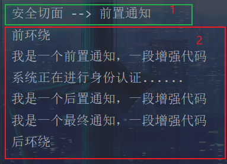

# 面向切面编程AOP

IoC使软件组件松耦合。AOP让你能够捕捉系统中经常使用的功能，把他转换为组件

AOP（Aspect Oriented Programming）: 面向切面编程，面向方面编程。（AOP是一种编程技术）

- 切面：与业务逻辑没有关系的通用代码

AOP是对OOP的延伸补充

AOP的底层使用的就是动态代理

Spring的AOP使用的动态代理是：JDK + CGLIB动态代理技术

Spring在这两种动态代理中灵活切换，如果是接口，默认选择JDK，如果是类，且没有实现接口，就会切换到CGLIB

当然，也可以通过配置强制使用CGLIB


## AOP介绍

一般一个系统中，都会有一些系统服务，例如：日志、事务管理、安全等，这些系统服务被称为：**交叉业务**

交叉业务几乎是通用的，如果每个业务处理中，将代码加进入，会存在两方面问题：

- 交叉业务代码在多个业务流程中反复出现，交叉业务代码没有得到复用，维护成本高
- 程序员无法专注在核心业务上编写代码

AOP，可以很容易解决上述问题


- AOP：将与核心业务无关的代码单独抽取出来，形成一个组件，然后以横向交叉的形式应用到业务流程中的**过程**，成为AOP
- AOP的优点：
  - 代码复用性增强
  - 代码易维护
  - 使开发者，更关注于业务逻辑


## AOP的七大术语

```java
public class UserService{
    public void do1(){
        System.out.println("do 1");
    }
    public void do2(){
        System.out.println("do 2");
    }
    public void do3(){
        System.out.println("do 3");
    }
    public void do4(){
        System.out.println("do 4");
    }
    public void do5(){
        System.out.println("do 5");
    }
    // 核心业务方法
    public void service(){
        do1();
        do2();
        do3();
        do5();
    }
}
```

- **连接点**（Joinpoint）

  - 【**连接点**，描述的是位置】

  - 在程序的整个执行流程中，**可以织入**切面的位置

    方法的执行前后、异常抛出后等位置

- **切点**（Pointcut）

  - 【**切点**，本质上就是方法】
  - 在程序执行流程中，**真正织入**切面的方法（一个切面，对应多个连接点）

- **通知**（Advice）

  - 【**通知**，又叫做增强，描述的是具体需要织入的**代码**】
  - 通知包括：
    - 前置通知
    - 后置通知
    - 环绕通知
    - 异常通知
    - 最终通知

- **切面**（Aspect）

  - **切点 + 通知就是切面**

- 织入（Weaving）

  - 把通知应用到目标对象上的过程

- 代理对象（Proxy）

  - 一个目标对象，被织入通知后产生的新对象


## 切点表达式

> 切点表达式，用来定义通知（Advice）往哪些方法上切入


**语法格式：**

```java
execution([访问控制权限修饰符] 返回值类型 [全限定类名]方法名(形参) [异常])
```

访问控制权限修饰符：

- 【可选项】
- 默认包括4个权限
- 些`public`就表示只包括公开的方法

返回值类型：

- 【必选项】
- `*`表示返回值类型任意

全限定类名：

- 【可选项】
- 两个点`..`代表，当前包以及包下所有的类
- 省略时表示所有的类

方法名：

- 【必选项】
- `*`表示所有方法
- `set*`表示所有的`setter`方法

形参：

- 【必选项】
- `()`表示没有参数的方法
- `(..)`表示类型和个数随意的方法
- `(*)`只有一个参数的方法
- `(*, String)`第一个类型随意，第二个类型是`String`类型

异常：

- 【可选项】
- 省略时，表示任意异常类型


```java
// service包下所有的类中以delete开始的所有方法
execution(public * com.powernode.mall.service.*.delete*(..))
```

```java
// mall包下所的类的所有方法
execution(* com.powernode.mall..*(..))
```

```java
// 所有类的所有方法
execution(* *(..))
```


## Spring的AOP

> Spring对AOP的实现包括三种：
>
> - **Spring框架结合AspectJ框架实现AOP，基于注解方法**
> - **Spring框架结合AspectJ框架实现AOP，基于XML方法**
> - Spring框架自己实现的AOP，基于XML配置方法


**AspectJ框架**

- 是Eclipse组织的一个支持AOP框架，是独立于Spring的一个框架
- Spring框架运用了AspectJ框架


### 准备工作

1. 引入相关的依赖

```xml
<dependencies>
        <!-- spring6框架依赖 -->
        <dependency>
            <groupId>org.springframework</groupId>
            <artifactId>spring-context</artifactId>
            <version>6.0.10</version>
        </dependency>
        <!-- aspectj依赖 -->
        <dependency>
            <groupId>org.springframework</groupId>
            <artifactId>spring-aspects</artifactId>
            <version>6.0.10</version>
        </dependency>
</dependencies>
```

2. Spring配置文件中，添加context命名空间和aop命名空间

```xml
<?xml version="1.0" encoding="UTF-8"?>
<beans xmlns="http://www.springframework.org/schema/beans"
       xmlns:xsi="http://www.w3.org/2001/XMLSchema-instance"
       xmlns:context="http://www.springframework.org/schema/context"
       xmlns:aop="http://www.springframework.org/schema/aop"
       xsi:schemaLocation="http://www.springframework.org/schema/beans http://www.springframework.org/schema/beans/spring-beans.xsd
                           http://www.springframework.org/schema/context http://www.springframework.org/schema/context/spring-context.xsd
                           http://www.springframework.org/schema/aop http://www.springframework.org/schema/aop/spring-aop.xsd">

</beans>
```


### 注解方式实现

1. 目标类、目标方法

   ```java
   package com.powernode.spring6.service;
   
   import org.springframework.stereotype.Component;
   
   /**
    * @author Solider
    * @version 1.0
    * @Date 2023/9/5 14:54
    * @since 1.0
    */
   // 目标类
   @Component
   public class UserService {
   
       // 目标方法
       public void login() {
           System.out.println("系统正在进行身份认证......");
       }
   }
   ```

2. 切面类 

   > 切面 = 切点 + 通知

   ```java
   package com.powernode.spring6.service;
   
   import org.aspectj.lang.annotation.Aspect;
   import org.aspectj.lang.annotation.Before;
   import org.springframework.stereotype.Component;
   
   /**
    * @author Solider
    * @version 1.0
    * @Date 2023/9/5 14:56
    * @since 1.0
    */
   // 切面类
   @Aspect
   @Component
   public class LogAspect {
   
       // 切面 = 切点 + 通知
       // 通知就是具体要增强的代码
   
       // 1、前置通知
       @Before("execution(* com.powernode.spring6.service.UserService.*(..))")
       public void advice() {
           System.out.println("我是一个通知，一段增强代码");
       }
   }
   ```

3. 测试程序

   ```java
   package com.powernode.spring6.test;
   
   import com.powernode.spring6.service.UserService;
   import org.junit.Test;
   import org.springframework.context.ApplicationContext;
   import org.springframework.context.support.ClassPathXmlApplicationContext;
   
   /**
    * @author Solider
    * @version 1.0
    * @Date 2023/9/5 15:12
    * @since 1.0
    */
   public class SpringAOPTest {
   
       @Test
       public void testBefore() {
           ApplicationContext applicationContext =
                   new ClassPathXmlApplicationContext("spring.xml");
           UserService userService = applicationContext.getBean("userService", UserService.class);
           userService.login();
       }
   }
   ```

4. 执行结果

   


**五个通知类别对应的注解方式：**

- 前置通知`@Before(切点表达式)`

  ```java
  // 1、前置通知
      @Before("execution(* com.powernode.spring6.service.UserService.*(..))")
      public void beforeAdvice() {
          System.out.println("我是一个前置通知，一段增强代码");
      }
  ```

- 后置通知`@AfterReturing(切点表达式)`

  ```java
  // 2、后置通知
      @AfterReturning("execution(* com.powernode.spring6.service.UserService.*(..))")
      public void afterReturningAdvice() {
          System.out.println("我是一个后置通知，一段增强代码");
      }
  ```

- 环绕通知`@Around(切点表达式)`

  ```java
  // 3、环绕通知
      @Around("execution(* com.powernode.spring6.service.UserService.*(..))")
      public void aroundAdvice(ProceedingJoinPoint joinPoint) throws Throwable {
          // 前置通知
          System.out.println("前环绕");
          // 执行目标
          joinPoint.proceed();
          // 后置通知
          System.out.println("后环绕");
      }
  ```

  - 注意：环绕通知需要 *连接点* 参数

  - 并调用`proceed()`方法获取切点

  - 而且环绕通知的范围是最大的

    

- 异常通知`@AfterThrowing(切点表达式)`

  ```java
  // 4、异常通知
      @AfterThrowing("execution(* com.powernode.spring6.service.UserService.*(..))")
      public void afterThrowsAdvice() {
          System.out.println("我是一个异常通知，一段增强代码");
      }
  ```

  

- 最终通知`@After(切点表达式)`

  ```java
  // 5、最终通知
      @After("execution(* com.powernode.spring6.service.UserService.*(..))")
      public void afterAdvice() {
          System.out.println("我是一个最终通知，一段增强代码");
      }
  ```

  


**切面的优先级控制**

- 通过注解：`@Order(1,2,3...)`实现
- 数字越小，优先级越高

> 上述模块中，加入安全切面

```java
package com.powernode.spring6.service;

import org.aspectj.lang.annotation.Aspect;
import org.aspectj.lang.annotation.Before;
import org.springframework.core.annotation.Order;
import org.springframework.stereotype.Component;

/**
 * @author Solider
 * @version 1.0
 * @Date 2023/9/5 15:59
 * @since 1.0
 */
// 安全切面类
@Component
@Aspect
@Order(1)
public class SecurityAspect {

    // 前置通知
    @Before("execution(* com.powernode.spring6.service.UserService.*(..))")
    public void beforeAdvice() {
        System.out.println("安全切面 --> 前置通知");
    }
}
```


> 测试，输出结果




**切点的通用代码**

> 为了使切点表达式可以得到复用，可以编写一个通用切点代码

```java
// 定义通用的切点表达式
    @Pointcut("execution(* com.powernode.spring6.service.UserService.*(..))")
    public void pointcut() {} // 此方法只做标记，不需要填写代码
```


- 注意，通用切点可以跨类使用，但是前面必须加上包名

  


**连接点JoinPoint**

```java
// 1、前置通知
    @Before("pointcut()")
    public void beforeAdvice(JoinPoint joinPoint) {
        System.out.println("我是一个前置通知，一段增强代码");

        // 获取目标方法的签名
        // 什么是方法的签名？
        // 方法的签名 = 方法的修饰符 + 方法的返回值类型 + 方法名 + 方法的参数列表
        // public static final void login(..) ==> 这就是方法的签名
        // Signature signature = joinPoint.getSignature();
        // 可以通过签名对象获取方法的对应信息
        String name = joinPoint.getSignature().getName();
        System.out.println("目标方法的方法名：" + name);
    }
```


### Spring-AOP之全注解式开发

1. 配置类

   ```java
   package com.powernode.spring6.config;
   
   import org.springframework.context.annotation.ComponentScan;
   import org.springframework.context.annotation.Configuration;
   import org.springframework.context.annotation.EnableAspectJAutoProxy;
   
   /**
    * @author Solider
    * @version 1.0
    * @Date 2023/9/5 16:27
    * @since 1.0
    */
   @Configuration // 作为配置类，替代xml配置文件
   @ComponentScan("com.powernode.spring6.service") // 组件扫描
   @EnableAspectJAutoProxy // 开启AspectJ自动代理
   public class SpringConfig {
   }
   ```

2. 测试类

   ```java
   package com.powernode.spring6.test;
   
   import com.powernode.spring6.config.SpringConfig;
   import com.powernode.spring6.service.UserService;
   import org.junit.Test;
   import org.springframework.context.ApplicationContext;
   import org.springframework.context.annotation.AnnotationConfigApplicationContext;
   
   /**
    * @author Solider
    * @version 1.0
    * @Date 2023/9/5 15:12
    * @since 1.0
    */
   public class SpringAOPTest {
   
       @Test
       public void testNoXML() {
           ApplicationContext ApplicationContext =
                   new AnnotationConfigApplicationContext(SpringConfig.class);
           UserService userService = ApplicationContext.getBean("userService", UserService.class);
           userService.login();
       }
   }
   ```

